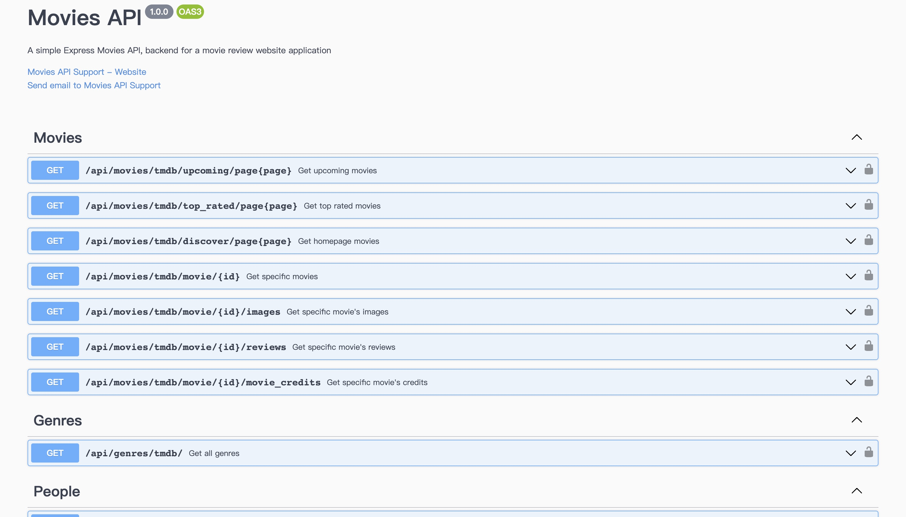
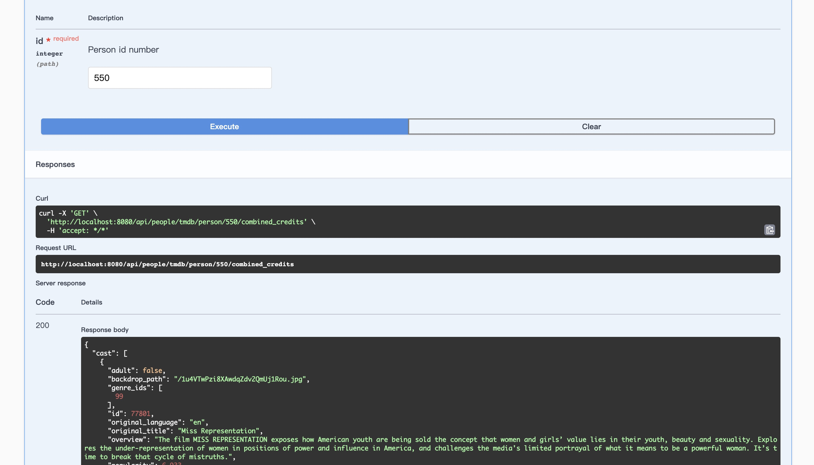
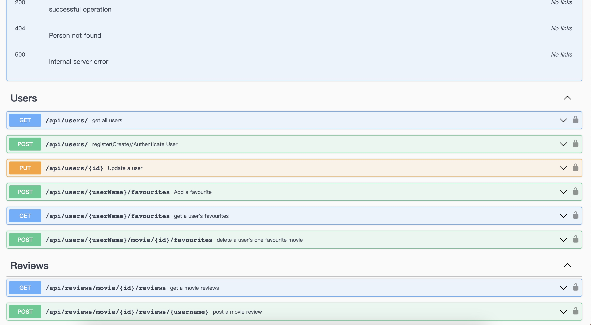

# Assignment 2 - Web API.

Name: Kaiyu Chen

## Features.

 + More new API routes with parameterized URLs.
 + All APIs used by the frontend are now processed by the backend.
 + Authentication service is no longer provided by Firebase, but by Movies-API (my backend).
 + Some pages now require authentication before data can be accessed. (New protected routes.)
 + Only logged-in users can now leave review or favorite movies.
 + User reviews are now stored in MongoDB and can be accessed through MongoDB.
 + New validation using regular expressions. 
 + Most APIs now support error handling and have new express middleware.
 + Using swagger to document all APIs.
## Setup requirements.

open one terminal  
`cd movies-api`  
`npm run dev`  
open another terminal  
`cd movies-app`  
`npm start`  

## API Configuration

 + create a `.env` file in the movies-api folder as below:
    ______________________
    NODE_ENV=development  
    PORT=8080   
    HOST=localhost  
    MONGO_DB=YourMongoURL  
    SEED_DB=True  
    SECRET=YourJWTSecret  
    REACT_APP_TMDB_KEY=YourTMDBApiKey  
    ______________________

## API Design  

When this movies-api server is running, you can visit this api server's document by visiting [swagger](http://localhost:8080/api-docs/)

### [Movies](movies-api/api/movies/index.js)  
+ /api/movies/tmdb/discover/page:page | GET | Gets a list of movies for the home page.  
+ /api/movies/tmdb/upcoming/page:page | GET | Gets a list of movies for the upcoming movie page.  
+ /api/movies/tmdb/top_rated/page:page | GET | Gets a list of movies for the top rated movie page.  
+ /api/movies/tmdb/movie/:id | GET | Gets a single movie's detail for the movie details page.  
+ /api/movies/tmdb/movie/:id/images | GET | Gets a single movie's images.  
+ /api/movies/tmdb/movie/:id/reviews | GET | Gets a single movie's reviews.  
+ /api/movies/tmdb/movie/:id/movie_credits | GET | Gets a single movie's credits.  

### [People](movies-api/api/people/index.js)  
+ /api/people/tmdb/popular/page:page | GET | Gets popular people for popular people page.  
+ /api/people/tmdb/person/:id | GET | Gets a single person's detail for the person details page.  
+ /api/people/tmdb/person/:id/images | GET | Gets a single person's images.  
+ /api/people/tmdb/person/:id/combined_credits | GET | Gets a single person's combined credits.  

### [Genres](movies-api/api/genres/index.js)    
+ /api/genres/ | GET | Gets all genres.  

### [Reviews](movies-api/api/reviews/index.js)    
+ /api/reviews/movie/:id/reviews | GET | Gets a single movie's reviews both from TMDB and MONGODB.  
+ /api/reviews/movie/:id/reviews/:username | POST | Posts or updates a review from the logged in user for a single movie.  

### [Users](movies-api/api/users/index.js)  
+ /api/users/ | GET | Gets all users.  
+ /api/users/ | POST | Registers/Authenticates a user. The body should include username and password.  
+ /api/users/:id | Put | Updates a single user's information.  
+ /api/users/:userName/favourites | POST | Add a single movie to a single user's favourites. The body should include the movie's id.
+ /api/users/:userName/favourites | GET | Gets a single user's all favourite movies.  
+ /api/users/:username/movie/:id/favourites | POST | Delete a speicfic movie from a single user's all favourite movies.

## Security and Authentication

JWT Authentication is utilized by the application to manage user sessions for crucial user functions such as favorites and reviews.  
+ Favourite Movies Page (/movies/favorites/)
+ The Review Form Page (/reviews/form/)

## Integrating with React App

All [api](#api-design) are now use my api (from movies-api) and now most are with error logs.  
Updates of the React App:  
+ When a user attempts to access a protected page, they are redirected to the login page.  
+ Users can only add their favorite movies to a list after logging in, and the movies marked as favorites (with a red heart icon) will not be visible when the user logs out.  
+ The registration process now includes notifications for incorrect input.  
+ All reviews are now stored in MongoDB, and users can update their own reviews after logging in. These reviews, along with all other reviews from TMDB, will be displayed to other users.  

## Independent learning (if relevant)

Now Using [swagger](https://swagger.io/) to document the API by following the instrustion from [wdpm](https://wdpm.gitbook.io/swagger-documentation/).
